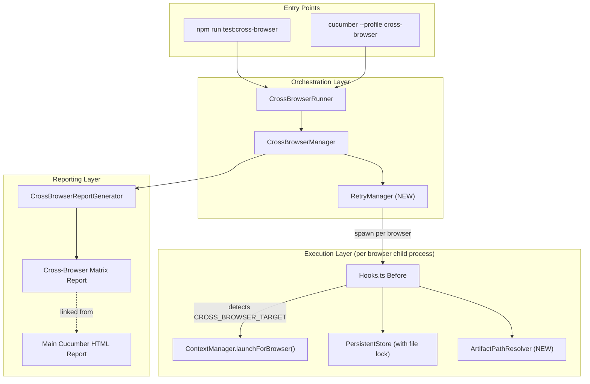
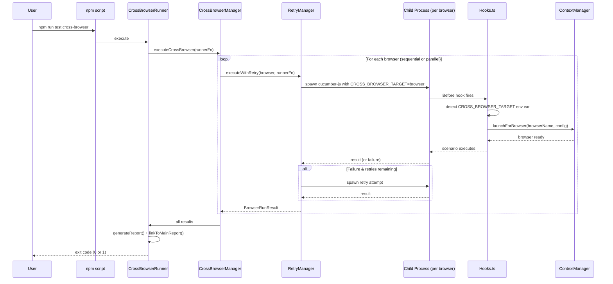
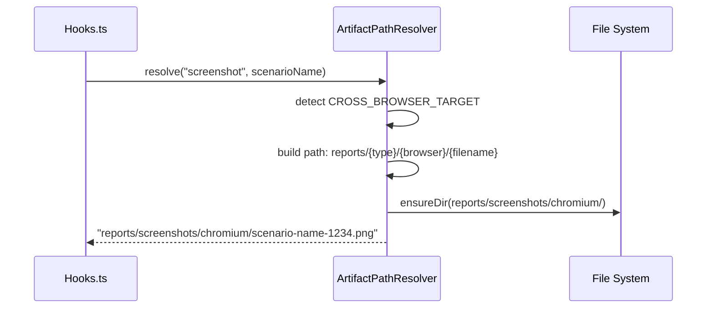

# Design Document: Cross-Browser Enhancement and Synchronization for v1.1 Framework

## Overview

This enhancement brings the existing cross-browser infrastructure in the BDD Playwright v1.1 framework to production readiness. The core components (`CrossBrowserManager`, `CrossBrowserRunner`, `CrossBrowserReportGenerator`, `TagParser`, `ContextManager.launchForBrowser()`) already exist and handle multi-browser orchestration, tag filtering, child process spawning, and report generation.

What's missing is the "last mile" integration: the Hooks layer doesn't detect the `CROSS_BROWSER_TARGET` env var to use `launchForBrowser()`, there are no npm scripts or Cucumber profiles for convenient execution, no unit tests exist for the cross-browser modules, the PersistentStore has race conditions under parallel execution, artifact paths collide across browsers, there's no retry mechanism per browser, and the cross-browser report isn't linked from the main report. This design addresses all 10 gaps systematically.

The approach preserves existing APIs and behavior, layering enhancements on top without breaking changes. Each gap maps to a well-scoped change in an existing file or a new file.

## Architecture



## Sequence Diagrams

### Cross-Browser Execution Flow (with retry)



### Artifact Path Isolation



## Components and Interfaces

### Component 1: Hooks Integration (Enhancement)

**Purpose**: Detect `CROSS_BROWSER_TARGET` env var in the Before hook and route to `ContextManager.launchForBrowser()` instead of `ContextManager.launch()`.

**Interface** (existing Before hook, modified logic):
```typescript
// In Hooks.ts Before hook — new detection block
const crossBrowserTarget = process.env.CROSS_BROWSER_TARGET as 'chromium' | 'firefox' | 'webkit' | undefined;

if (crossBrowserTarget && !isApiOnly && !hasMobileTags) {
  // Use browser-specific launch with config from env vars
  await this.contextManager.launchForBrowser(crossBrowserTarget, frameworkConfig);
  this.initActionEngine();
} else {
  // Existing logic (standard launch or device emulation)
}
```

**Responsibilities**:
- Detect `CROSS_BROWSER_TARGET` env var presence
- Parse `CROSS_BROWSER_VIEWPORT`, `CROSS_BROWSER_HEADLESS`, `CROSS_BROWSER_ARGS` from env
- Call `launchForBrowser()` with the correct browser name
- Skip standard `launch()` when in cross-browser child process mode

### Component 2: RetryManager (New)

**Purpose**: Wrap individual browser executions with configurable retry logic before marking a browser as failed.

**Interface**:
```typescript
export interface RetryConfig {
  maxRetries: number;        // default: 1 (from framework.properties)
  retryDelay: number;        // ms between retries, default: 2000
  retryOnlyOnLaunchFailure: boolean;  // only retry if browser failed to launch
}

export class RetryManager {
  constructor(config: RetryConfig);
  
  /**
   * Execute a browser run with retry logic.
   * Retries up to maxRetries times if the runner throws.
   */
  async executeWithRetry(
    browser: string,
    runner: (browser: string) => Promise<BrowserRunResult>
  ): Promise<BrowserRunResult>;
}
```

**Responsibilities**:
- Retry failed browser runs up to N times
- Log each retry attempt with reason
- Return the successful result or the last failure
- Respect `retryOnlyOnLaunchFailure` to distinguish launch errors from test failures

### Component 3: ArtifactPathResolver (New)

**Purpose**: Generate browser-namespaced file paths for screenshots, videos, and other artifacts to prevent overwrites during cross-browser execution.

**Interface**:
```typescript
export class ArtifactPathResolver {
  /**
   * Resolve an artifact path with browser namespace.
   * When CROSS_BROWSER_TARGET is set, inserts the browser name into the path.
   * 
   * @example
   * resolve('screenshots', 'login-failure.png')
   * // Normal: reports/screenshots/login-failure.png
   * // Cross-browser: reports/screenshots/chromium/login-failure.png
   */
  static resolve(artifactType: string, filename: string): string;
  
  /**
   * Get the current browser context (from env var or config default).
   */
  static getCurrentBrowser(): string | undefined;
  
  /**
   * Ensure the artifact directory exists.
   */
  static ensureDir(dirPath: string): void;
}
```

**Responsibilities**:
- Detect `CROSS_BROWSER_TARGET` env var
- Insert browser name as subdirectory when in cross-browser mode
- Create directories as needed
- Provide consistent path resolution across all hook phases

### Component 4: PersistentStore File Locking (Enhancement)

**Purpose**: Prevent race conditions when multiple parallel browser processes write to `runtime-store.json`.

**Interface** (enhancement to existing PersistentStore):
```typescript
// New method additions to PersistentStore class
export class PersistentStore {
  // Existing methods unchanged...
  
  /**
   * Acquire an exclusive file lock before writing.
   * Uses a .lock file with exponential backoff retry.
   */
  private async acquireLock(lockPath: string, timeout?: number): Promise<void>;
  
  /**
   * Release the file lock after writing.
   */
  private releaseLock(lockPath: string): void;
  
  /**
   * Write data with file locking for parallel safety.
   */
  async safeWrite(key: string, value: unknown): Promise<void>;
}
```

**Responsibilities**:
- Create `.lock` file atomically using `fs.writeFileSync` with `wx` flag
- Retry lock acquisition with exponential backoff (max 5 attempts)
- Release lock in finally block
- Fall back to browser-specific store files if lock contention exceeds threshold

### Component 5: CrossBrowser Cucumber Profile (New)

**Purpose**: Provide a `cross-browser` profile in `cucumber.yml` that configures appropriate format and output for cross-browser child processes.

**Configuration**:
```yaml
cross-browser:
  requireModule:
    - ts-node/register
  require:
    - src/core/CustomWorld.ts
    - src/hooks/Hooks.ts
    - src/steps/**/*.ts
  paths:
    - features/**/*.feature
  format:
    - json:reports/cucumber-json/${CROSS_BROWSER_TARGET:-default}-cucumber-report.json
  formatOptions:
    snippetInterface: async-await
  parallel: 1
```

### Component 6: npm Scripts (Enhancement)

**Purpose**: Add convenient npm scripts for cross-browser execution.

**Scripts**:
```json
{
  "test:cross-browser": "ts-node src/core/CrossBrowserRunner.ts",
  "test:cross-browser:parallel": "cross-env CROSS_BROWSER_PARALLEL=true ts-node src/core/CrossBrowserRunner.ts",
  "test:chromium": "cross-env CROSS_BROWSER_TARGET=chromium cucumber-js --profile cross-browser",
  "test:firefox": "cross-env CROSS_BROWSER_TARGET=firefox cucumber-js --profile cross-browser",
  "test:webkit": "cross-env CROSS_BROWSER_TARGET=webkit cucumber-js --profile cross-browser"
}
```

### Component 7: Report Linking (Enhancement)

**Purpose**: Inject a link to the cross-browser matrix report in the main Cucumber HTML report generation step.

**Interface** (enhancement to report generation):
```typescript
export class ReportLinker {
  /**
   * After main report generation, inject a cross-browser report link
   * if the cross-browser report file exists.
   */
  static linkCrossBrowserReport(mainReportPath: string, crossBrowserReportPath: string): void;
}
```

### Component 8: BeforeAll Report Directory Setup (Enhancement)

**Purpose**: Ensure `reports/cross-browser/` directory is created in the BeforeAll hook.

## Data Models

### RetryConfig (framework.properties additions)

```properties
# Cross-browser retry configuration
crossBrowser.retryCount=1
crossBrowser.retryDelay=2000
crossBrowser.retryOnLaunchFailureOnly=false
```

### BrowserRunResult (existing, unchanged)

```typescript
interface BrowserRunResult {
  browser: 'chromium' | 'firefox' | 'webkit';
  totalScenarios: number;
  passed: number;
  failed: number;
  skipped: number;
  duration: number;
  scenarioResults: ScenarioResult[];
}
```

### RetryAttempt (new, for logging/reporting)

```typescript
interface RetryAttempt {
  browser: string;
  attempt: number;
  maxAttempts: number;
  error: string;
  timestamp: number;
}
```

## Algorithmic Pseudocode

### Hooks Before: Cross-Browser Detection Algorithm

```typescript
ALGORITHM detectAndLaunchCrossBrowser(world, frameworkConfig)
INPUT: world (CustomWorld), frameworkConfig (FrameworkConfig)
OUTPUT: browser launched correctly for cross-browser context

BEGIN
  crossBrowserTarget ← process.env.CROSS_BROWSER_TARGET
  
  IF crossBrowserTarget IS undefined THEN
    // Not in cross-browser child process — use standard logic
    RETURN standard_launch_logic()
  END IF
  
  ASSERT crossBrowserTarget IN ['chromium', 'firefox', 'webkit']
  
  // Parse additional env vars set by CrossBrowserRunner
  viewport ← parseViewport(process.env.CROSS_BROWSER_VIEWPORT)  // "1280x720" → {w,h}
  headless ← process.env.CROSS_BROWSER_HEADLESS === 'true'
  args ← (process.env.CROSS_BROWSER_ARGS || '').split(',').filter(Boolean)
  
  // Use launchForBrowser with env-driven config
  AWAIT world.contextManager.launchForBrowser(crossBrowserTarget, frameworkConfig)
  world.initActionEngine()
  
  Logger.info(`Cross-browser mode: launched ${crossBrowserTarget}`)
END
```

**Preconditions:**
- `frameworkConfig` is initialized and valid
- `world.contextManager` is available
- If `CROSS_BROWSER_TARGET` is set, it must be one of 'chromium', 'firefox', 'webkit'

**Postconditions:**
- Browser is launched with the correct engine specified by `CROSS_BROWSER_TARGET`
- Browser uses viewport/headless/args from env vars (which mirror framework.properties per-browser config)
- `world.actionEngine` is initialized

### Retry Algorithm

```typescript
ALGORITHM executeWithRetry(browser, runnerFn, config)
INPUT: browser (string), runnerFn (function), config (RetryConfig)
OUTPUT: BrowserRunResult

BEGIN
  lastError ← null
  
  FOR attempt = 1 TO config.maxRetries + 1 DO
    ASSERT attempt <= config.maxRetries + 1
    
    TRY
      result ← AWAIT runnerFn(browser)
      
      IF attempt > 1 THEN
        Logger.info(`Browser ${browser} succeeded on retry attempt ${attempt}`)
      END IF
      
      RETURN result
    CATCH error
      lastError ← error
      Logger.warn(`Browser ${browser} attempt ${attempt} failed: ${error.message}`)
      
      IF attempt <= config.maxRetries THEN
        IF config.retryOnlyOnLaunchFailure AND NOT isLaunchError(error) THEN
          // Don't retry test failures, only launch failures
          THROW error
        END IF
        
        AWAIT delay(config.retryDelay)
      END IF
    END TRY
  END FOR
  
  THROW lastError
END
```

**Preconditions:**
- `config.maxRetries >= 0`
- `config.retryDelay >= 0`
- `runnerFn` is an async function that resolves to `BrowserRunResult` or rejects

**Postconditions:**
- Returns `BrowserRunResult` if any attempt succeeds
- Throws the last error if all attempts fail
- Total attempts = `maxRetries + 1` (initial + retries)

**Loop Invariant:**
- `attempt` is in range [1, maxRetries + 1]
- `lastError` holds the most recent failure (null if no failure yet)

### File Locking Algorithm

```typescript
ALGORITHM acquireFileLock(lockPath, timeout)
INPUT: lockPath (string), timeout (number, default 5000ms)
OUTPUT: lock acquired (boolean)

BEGIN
  startTime ← Date.now()
  attempt ← 0
  maxAttempts ← 5
  
  WHILE attempt < maxAttempts DO
    ASSERT Date.now() - startTime < timeout
    
    TRY
      // Atomic file creation — fails if file already exists
      fs.writeFileSync(lockPath, process.pid.toString(), { flag: 'wx' })
      RETURN true  // Lock acquired
    CATCH error
      IF error.code === 'EEXIST' THEN
        // Lock held by another process
        backoff ← Math.min(100 * 2^attempt, 1000)
        AWAIT delay(backoff)
        attempt ← attempt + 1
      ELSE
        THROW error  // Unexpected filesystem error
      END IF
    END TRY
  END WHILE
  
  THROW new Error(`Failed to acquire lock after ${maxAttempts} attempts`)
END
```

**Preconditions:**
- `lockPath` is a valid writable filesystem path
- Process has write permissions to the directory

**Postconditions:**
- Lock file exists with current process PID
- No other process holds the same lock
- Lock must be released via `releaseLock()` in a finally block

**Loop Invariant:**
- `attempt` is in range [0, maxAttempts)
- Each iteration doubles the backoff delay (exponential)

### Artifact Path Resolution Algorithm

```typescript
ALGORITHM resolveArtifactPath(artifactType, filename)
INPUT: artifactType ('screenshots' | 'videos' | 'logs'), filename (string)
OUTPUT: resolved filesystem path (string)

BEGIN
  baseDir ← 'reports'
  browser ← process.env.CROSS_BROWSER_TARGET
  
  IF browser IS defined THEN
    resolvedPath ← path.join(baseDir, artifactType, browser, filename)
  ELSE
    resolvedPath ← path.join(baseDir, artifactType, filename)
  END IF
  
  // Ensure parent directory exists
  parentDir ← path.dirname(resolvedPath)
  IF NOT fs.existsSync(parentDir) THEN
    fs.mkdirSync(parentDir, { recursive: true })
  END IF
  
  RETURN resolvedPath
END
```

**Preconditions:**
- `artifactType` is a valid subdirectory name
- `filename` is a valid filename (no path separators)

**Postconditions:**
- Returned path is an absolute filesystem path
- Parent directory exists after call
- If `CROSS_BROWSER_TARGET` is set, browser name is included in path

## Key Functions with Formal Specifications

### Function 1: `CrossBrowserRunner.defaultRunnerFn()` (Enhanced)

```typescript
private async defaultRunnerFn(config: BrowserExecutionConfig): Promise<BrowserRunResult>
```

**Preconditions:**
- `config.browser` ∈ {'chromium', 'firefox', 'webkit'}
- `config.viewport.width > 0 ∧ config.viewport.height > 0`
- Cucumber CLI is available in PATH

**Postconditions:**
- Spawns child process with `CROSS_BROWSER_TARGET`, `CROSS_BROWSER_VIEWPORT`, `CROSS_BROWSER_HEADLESS`, `CROSS_BROWSER_ARGS` env vars
- Uses `--profile cross-browser` when cucumber.yml has the profile defined
- Returns valid `BrowserRunResult` (even if JSON parse fails, returns empty result)
- Child process output is captured but not leaked to parent stdout

### Function 2: `RetryManager.executeWithRetry()`

```typescript
async executeWithRetry(
  browser: string,
  runner: (browser: string) => Promise<BrowserRunResult>
): Promise<BrowserRunResult>
```

**Preconditions:**
- `browser` ∈ {'chromium', 'firefox', 'webkit'}
- `runner` is a valid async function
- `this.config.maxRetries >= 0`

**Postconditions:**
- If any attempt succeeds: returns `BrowserRunResult`
- If all attempts fail: throws the error from the last attempt
- Total invocations of `runner` ≤ `maxRetries + 1`
- Each retry is preceded by `retryDelay` ms pause

### Function 3: `ArtifactPathResolver.resolve()`

```typescript
static resolve(artifactType: string, filename: string): string
```

**Preconditions:**
- `artifactType` is non-empty string
- `filename` is non-empty string without path separators

**Postconditions:**
- Returns absolute path string
- Path includes browser subdirectory if and only if `CROSS_BROWSER_TARGET` env var is set
- Parent directory of returned path exists on filesystem

### Function 4: `PersistentStore.safeWrite()`

```typescript
async safeWrite(key: string, value: unknown): Promise<void>
```

**Preconditions:**
- `key` is non-empty string
- Store file path is accessible

**Postconditions:**
- Data is written to store file atomically (lock acquired before write, released after)
- No data corruption from concurrent writes by parallel browser processes
- Lock is always released (even if write throws)

## Example Usage

```typescript
// Example 1: Running cross-browser tests via npm
// $ npm run test:cross-browser

// Example 2: Running with retry in CrossBrowserManager
const retryManager = new RetryManager({
  maxRetries: 1,
  retryDelay: 2000,
  retryOnlyOnLaunchFailure: false,
});

const result = await retryManager.executeWithRetry('firefox', async (browser) => {
  const config = runner.resolveBrowserConfig(browser as any);
  return runner.defaultRunnerFn(config);
});

// Example 3: Artifact path resolution in hooks
import { ArtifactPathResolver } from '../core/ArtifactPathResolver';

const screenshotPath = ArtifactPathResolver.resolve('screenshots', `failure-${Date.now()}.png`);
// In normal mode:       reports/screenshots/failure-1234.png
// In cross-browser mode: reports/screenshots/chromium/failure-1234.png

await page.screenshot({ path: screenshotPath, fullPage: true });

// Example 4: PersistentStore safe write in parallel
const store = PersistentStore.getInstance();
await store.safeWrite('lastBrowserRun', {
  browser: 'chromium',
  timestamp: Date.now(),
  status: 'passed',
});

// Example 5: Hooks.ts detecting cross-browser mode
// (Inside Before hook)
const crossBrowserTarget = process.env.CROSS_BROWSER_TARGET;
if (crossBrowserTarget) {
  await this.contextManager.launchForBrowser(
    crossBrowserTarget as 'chromium' | 'firefox' | 'webkit',
    frameworkConfig
  );
} else {
  await this.contextManager.launch();
}
```

## Correctness Properties

### Property 1: Cross-Browser Target Routing

**∀ browser ∈ configured_browsers**: If `CROSS_BROWSER_TARGET` is set to `browser`, then `ContextManager.launchForBrowser(browser)` is called (not `launch()`)

### Property 2: Tag-Based Scenario Filtering

**∀ scenario, ∀ browser**: `shouldRunOnBrowser(tags, browser)` returns `{run: false}` ⟹ scenario is skipped with logged reason

### Property 3: PersistentStore Mutex

**∀ parallel execution**: No two processes hold the same PersistentStore lock simultaneously (mutual exclusion property)

### Property 4: Artifact Path Isolation

**∀ browser1 ≠ browser2**: `ArtifactPathResolver.resolve(type, file)` for browser1 ≠ `ArtifactPathResolver.resolve(type, file)` for browser2 (path uniqueness)

### Property 5: Retry Bound

**∀ browser run with retry**: Total attempts ≤ `maxRetries + 1` ∧ (succeeds ⟹ returns valid BrowserRunResult) ∧ (all fail ⟹ throws last error)

### Property 6: Report Generation Guarantee

**∀ cross-browser execution**: Report is generated if at least one browser completes successfully

### Property 7: Report Linkage

**∀ cross-browser report path**: If cross-browser report exists, it is linked from the main HTML report

## Error Handling

### Error Scenario 1: Browser Launch Failure in Cross-Browser Mode

**Condition**: `CROSS_BROWSER_TARGET` is set but the specified browser engine fails to launch (e.g., WebKit not installed on Linux)
**Response**: RetryManager retries the launch up to `crossBrowser.retryCount` times. If all retries fail, `CrossBrowserManager` marks the browser as failed with a skipped result and continues with remaining browsers.
**Recovery**: Other browsers continue execution. Final report shows the failed browser with error details.

### Error Scenario 2: PersistentStore Lock Contention

**Condition**: Multiple parallel browser processes attempt to write to `runtime-store.json` simultaneously
**Response**: Exponential backoff retry (100ms, 200ms, 400ms, 800ms, 1000ms). If lock cannot be acquired after 5 attempts, fall back to browser-specific store file (`runtime-store-{browser}.json`).
**Recovery**: Data integrity maintained. Browser-specific files are merged during report generation.

### Error Scenario 3: Artifact Path Collision (Legacy Protection)

**Condition**: External code bypasses `ArtifactPathResolver` and writes directly to `reports/screenshots/`
**Response**: Filenames include timestamp + browser name as suffix even when using the resolver, providing double protection.
**Recovery**: No data loss — older files not overwritten.

### Error Scenario 4: Cross-Browser Report Generation Failure

**Condition**: `CrossBrowserReportGenerator.generate()` throws (e.g., disk full, permission denied)
**Response**: Error is caught and logged. Test execution results are still valid. Exit code reflects test pass/fail, not report generation status.
**Recovery**: Results are available in individual browser JSON files under `reports/cucumber-json/`.

### Error Scenario 5: Invalid `CROSS_BROWSER_TARGET` Value

**Condition**: Env var is set to an unsupported browser name (e.g., "edge")
**Response**: Hooks.ts validates the value against `['chromium', 'firefox', 'webkit']`. If invalid, throws immediately with descriptive error message.
**Recovery**: Child process exits with error code. Parent CrossBrowserRunner marks that browser as failed.

## Testing Strategy

### Unit Testing Approach

Tests will use Vitest (already configured in the project) with `fast-check` for property-based tests.

**Key Test Suites to Create:**

1. **`tests/crossBrowser/CrossBrowserManager.spec.ts`**
   - `shouldRunOnBrowser()` — all tag combinations (only, skip, conflicting, none)
   - `validateBrowserTags()` — valid/invalid tag sets
   - `recordResult()` — accumulation correctness
   - `executeCrossBrowser()` — sequential and parallel modes, failure handling

2. **`tests/crossBrowser/CrossBrowserRunner.spec.ts`**
   - `shouldRunCrossBrowser()` — single vs multi-browser config
   - `resolveBrowserConfig()` — config resolution with overrides
   - `parseResultsFromJson()` — valid/invalid/missing JSON parsing

3. **`tests/crossBrowser/CrossBrowserReportGenerator.spec.ts`**
   - `calculateSummary()` — math correctness
   - `identifyBrowserSpecificFailures()` — detection logic
   - `buildMatrix()` — matrix construction with various result sets
   - `generate()` — HTML output contains expected elements

4. **`tests/crossBrowser/RetryManager.spec.ts`**
   - Retry behavior on failure
   - Immediate return on success
   - Max retries respected
   - Delay between retries

5. **`tests/crossBrowser/ArtifactPathResolver.spec.ts`**
   - Path includes browser when env var set
   - Path excludes browser when env var unset
   - Directory creation

### Property-Based Testing Approach

**Property Test Library**: fast-check (already in devDependencies)

**Properties to test:**
- For any set of scenario tags, `shouldRunOnBrowser` + `validateBrowserTags` are consistent (valid tags never produce contradictory run decisions)
- For any browser name and artifact type, resolved paths are unique across browsers
- For any sequence of `recordResult` calls, totals always equal sum of individual statuses
- RetryManager: for any N retries, runner is called exactly min(N+1, first_success_index+1) times

### Integration Testing Approach

- Smoke test: run `npm run test:cross-browser` with `browsers=chromium,firefox` and verify both JSON reports are generated
- Profile test: verify `cucumber-js --profile cross-browser` executes without error
- Report linkage: verify main report contains cross-browser report link after cross-browser run

## Performance Considerations

- **Parallel execution**: Respects `crossBrowser.maxParallel` to avoid overwhelming the system (default: 3)
- **File locking**: Lock timeout is 5 seconds with exponential backoff — won't block indefinitely
- **Artifact directories**: Created once per browser per run (not per scenario) via BeforeAll hook
- **Report generation**: Single-pass matrix building — O(browsers × scenarios) time complexity
- **Child process spawning**: Uses `spawn` (not `exec`) to avoid buffer overflow on large test suites

## Security Considerations

- Environment variables (`CROSS_BROWSER_TARGET`, etc.) are set by the parent process only — not user-injectable in normal flow
- Lock files use process PID — stale locks from crashed processes can be detected and cleaned
- Report HTML uses `escapeHtml()` to prevent XSS in generated reports
- No secrets are passed via cross-browser env vars (only browser names, viewport dimensions, boolean flags)

## Dependencies

- **Existing**: `@playwright/test`, `@cucumber/cucumber`, `ts-node`, `winston`, `multiple-cucumber-html-reporter`
- **Existing Dev**: `vitest`, `fast-check`
- **New**: `cross-env` (npm package for cross-platform env var setting in npm scripts) — optional, can use platform-specific syntax instead
- **No new runtime dependencies required** — all enhancements use Node.js built-in `fs` and `child_process`
